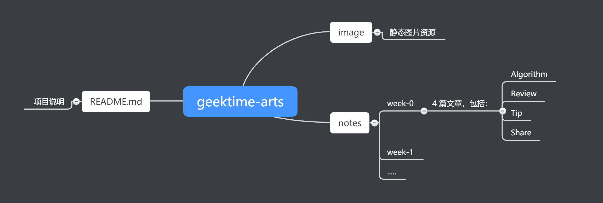

# geektime-arts

极客时间《左耳听风》专栏发起的 ARTS 打卡计划的实践记录。

## 什么是 ARTS

- ARTS 打卡计划说明：
    - [https://time.geekbang.org/column/article/85839](https://time.geekbang.org/column/article/85839)

## 项目组织结构

## 其他说明

- Algorithm 练习网站是 [中文 LeetCode](https://leetcode-cn.com)
- 算法具体实现以 **Java** 为主, 版本是 1.8